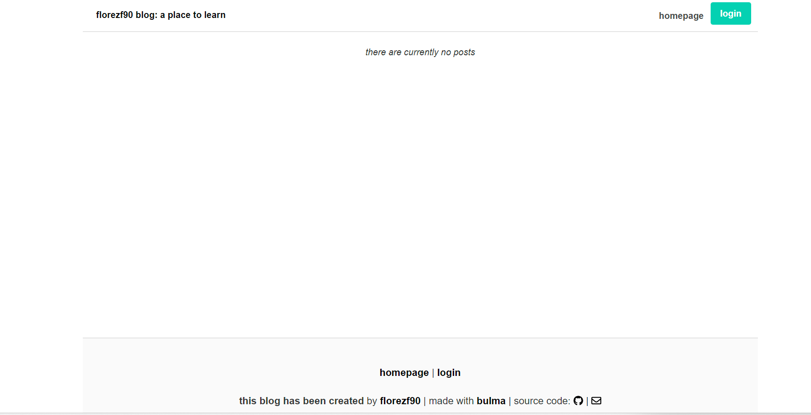

<h1 align= "center" id="title">full-stack-blogspot </h1>

  

# 👩‍💻 About

The present application is meant to demostrate the back end skills accuaried during the second section of UTSA_coding bootcamp, by appliying not only core concepts such as databases with sequelize, but also appliying a new file structure (NVC patter), which allows to apply important aspects of a website, such as log in, log out, or cookies, AKA sessions.

This time, based on the required criteria for the weekly challenge, it was required to create a blogpost that allow the user to signup, login, signout, create post, edit a post, delete a post, or add comments to the post, all of this, trying to keep a clean interface with a previously used CSS framework (bulma.CSS).

It's important to mention that the code present is deployed to heroku.

  
 📊 Table of Contents 

  <ol>
    <li>
      <a>About The Project</a>
        <li><a>Built With</a></li>
    </li>
    <li><a>Installation</a></li>
    <li><a >Usage</a></li>
    <li><a >Contributing and Contact</a></li>
    <li><a >Acknowledgments</a></li>
    <li><a >License</a></li>
  </ol>

---

# 💲Built With

List of any major frameworks/libraries used to design the project:

- 

- 

- 

- 

- 

* 

- 

* 

* 

* 

NOTE: PLEASE BE ADVISED all the tags contains links to most of the resources that I have used in order to make this app possible, I also refered to recordings and code lessons provided by my coding institution.

---

# 🚀 Installation

💿 Deployment link: https://florezf90-blog-72fb922e84b0.herokuapp.com/

This app is meant to be used as a regular website, feel free to interact with it (please report any issues or bugs ).

However, if you still want to use this app in a local envirioment, this is how:

First, clone the provided repository by following the next steps:

      git clone https://github.com/florezf90/fullstack-blogspot

2.Second, initialize the node package and accept the defaults by running:

        npm i

3.third, please add a .env file with the following variables:

     DB_NAME= 'please refere to the DB folder'
     DB_USER = 'yourpreference'
     DB_PASSWORD= 'yourpreference'

NOTE: the above image is a demo of the application working properly in the command line.

---

# 📖 Usage

4.Then, run the following command in order to get started with the localhost notice and start interacting with the website.

      node server.js

---

# 📱 Contributing and Contact

If you have a suggestion that would make this better, don't hesitate to reach me out and create a pull request. You can also simply open an issue with the tag "enhancement". Don't forget to give the project a star! Thanks again!

✉️ mail: florezf90@gmail.com

💿 Demo: https://florezf90-blog-72fb922e84b0.herokuapp.com/

---

# 🔒🔑 License

Distributed under the MIT License. See LICENSE.txt for more information.

## [🔝](#title)

[linkedin-shield]: https://img.shields.io/badge/-LinkedIn-black.svg?style=for-the-badge&logo=linkedin&colorB=555
[linkedin-url]: https://www.linkedin.com/in/luis-felipe-florez-98403123a/
